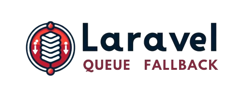

<p align="center">
    
</p>

<p align="center">
<!-- Total Downloads -->
<!-- Latest Stable Version -->
<!-- License -->
</p>

<p align="justify">
Laravel Queue Fallback is a package designed to provide seamless fallback mechanisms for queue services in Laravel applications. It ensures that your queued jobs are processed even if the primary queue service encounters issues, thereby enhancing the reliability and resilience of your application's background processing tasks.
</p>


## Features

- Automatic fallback to secondary queue service in case of primary service failures.
- Configuration options for customizing fallback behavior.
- Compatibility with Laravel's native queue configuration and services.

## Installation

You can install the package via Composer. Run the following command in your terminal:

```bash
composer require sanmark/laravel-queue-fallback
```
Add fallback queue connection (add below env file into your project .env file)

```env
FAILBACK_QUEUE_CONNECTION = "database"
```

## Usage
To use this package, you need to:

Use the **Sanmark\QueueFallback\ShouldFallback** trait in your job files.

```php
namespace App\Jobs;

use Sanmark\QueueFallback\ShouldFallback;
use Illuminate\Bus\Queueable;
use Illuminate\Queue\SerializesModels;
use Illuminate\Queue\InteractsWithQueue;
use Illuminate\Contracts\Queue\ShouldQueue;
use Illuminate\Foundation\Bus\Dispatchable;

class ExampleJob implements ShouldQueue
{
    use Dispatchable, InteractsWithQueue, Queueable, SerializesModels, ShouldFallback;

    public function handle()
    {
        // Job logic here
    }
}
```
Use dispatchWithFallback instead of dispatch when dispatching jobs.

```php
use App\Jobs\ExampleJob;


ExampleJob::dispatchWithFallback($parameter);
```

This ensures that if the primary queue service fails, the job will be automatically dispatched to the secondary queue service specified in the configuration.

## Configuration
After installing the package, you can configure it by publishing the configuration file. Run the following artisan command:

```bash
php artisan vendor:publish --provider="Sanmark\\QueueFallback\\QueueFallbackServiceProvider"
```
This command will publish a configuration file named `queue-fallback.php` in your Laravel application's config directory. You can customize the fallback behavior and specify your secondary queue service in this file.

## Contributing
Contributions are welcome! If you have any ideas, suggestions, or bug reports, please open an issue or submit a pull request on GitHub.

## License
This package is open-sourced software licensed under the [MIT](LICENSE.md) license.